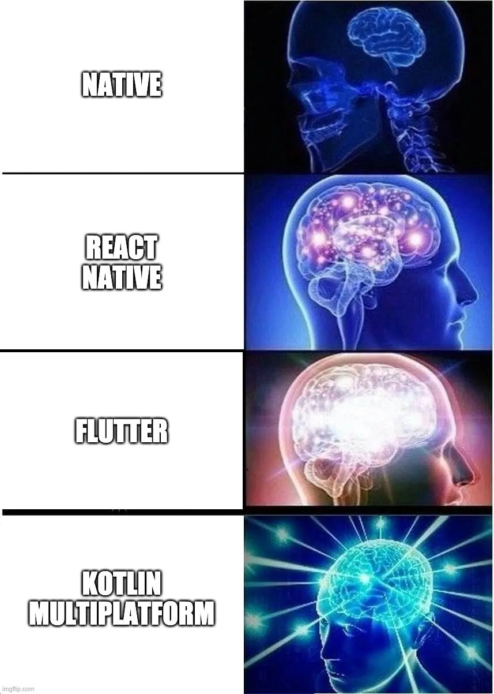
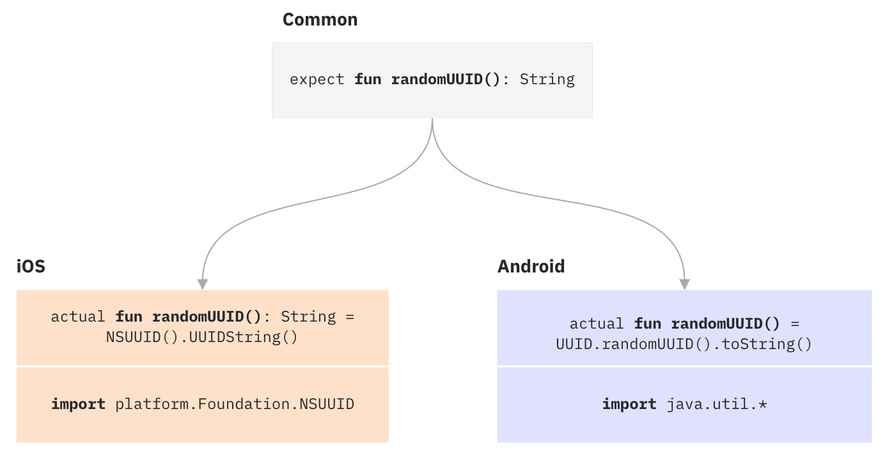
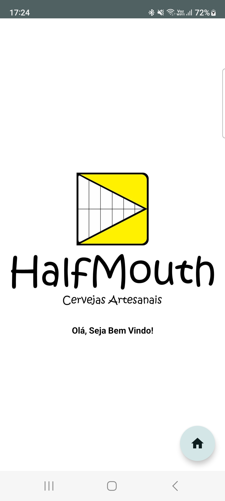

# HalfMouthBeerApp

Projeto utilizando Kotlin Multiplatform Mobile(KMM) para exibir informações remotas de monitoramento
de equipamentos da crevejaria artesanal HalfMouth.

## O que é Kotlin Multiplatform Mobile (KMM)

Trata-se de uma feature do Kotlin, criada pela JetBrains, que permite compartilhar código comum
entre múltiplas plataformas (JavaScript, iOS, Android, desktop, etc).
A premissa é que você pode escrever sua lógica de negócio apenas uma vez em Kotlin e usar esse
código tanto no Android quanto no iOS.
Porém, ainda temos a necessidade de escrever códigos de UI específicos de acordo com cada plataforma

## Como funciona?

O KMM é flexível o suficiente para permitir que o desenvolvedor diferencie a implementação de API
específica do Android e iOS sempre que necessário.
Ele usa o mecanismo expect/actual para conseguir isso.

Esse mecanismo é parecido com uma interface, onde o módulo compartilhado define uma declaração com a
palavra chave expect e os módulos de cada plataforma proveem a declaração com a palavra chave actual
escritos em Kotlin (e posteriormente compilados para Swift no caso do iOS).
Depois que o módulo compartilhado é criado, o resultado final do módulo compartilhado é o arquivo
.framework para iOS e o arquivo .jar para Android.
Então, logicamente falando, seus projetos Android e iOS nem sabem que o módulo compartilhado está
escrito em Kotlin, para eles é apenas mais uma dependência.

## Tecnologias Utilizadas

- Kotlin Multiplatform Mobile(KMM);
- Compose Multiplatform;
- Material3 Theme;
- Compartilhamento de recursos (Share Resources: Strings e Imagens) entre Andoid e iOS usando KMM;
- DynamicColor utilizando MaterialTheme;

## Futuras Integrações

- Firebase Authentication;
- Inclusão do Retrofit;
- Integração com a Plataforma ThingSpeak para aquisição de dados;
- Tela de Exibição dos Dados e Gráficos;
- Banco de Dados Local;

## Tela do Aplicativo

Tela Inicial com o Logo da Cervejaria:

## Vantagens do KMM

- Lógica de negócios compartilhada em grande parte independente da plataforma;
- A interoperabilidade com outras linguagens nos permite usar código Kotlin em Java, Swift ou
  Objective-C e vice-versa;
- Mecanismo expect/actual para definir a estrutura em código comum e fornecer a implementação em
  diretórios específicos da plataforma;
- Capacidade de usar bibliotecas específicas da plataforma no projeto KMP usando Gradle (para
  Android) ou Cocoapods (para iOS);
- Possibilidade futura de compartilhar código de UI também, graças ao Jetpack Compose e Compose for
  Desktop.

## Desvantagens do KMM

- Falta de bibliotecas, ferramentas imaturas;
- Comunidade relativamente menor em comparação com React Native ou Flutter;
- Novo sistema de construção e linguagem a ser aprendida pelos desenvolvedores iOS;
